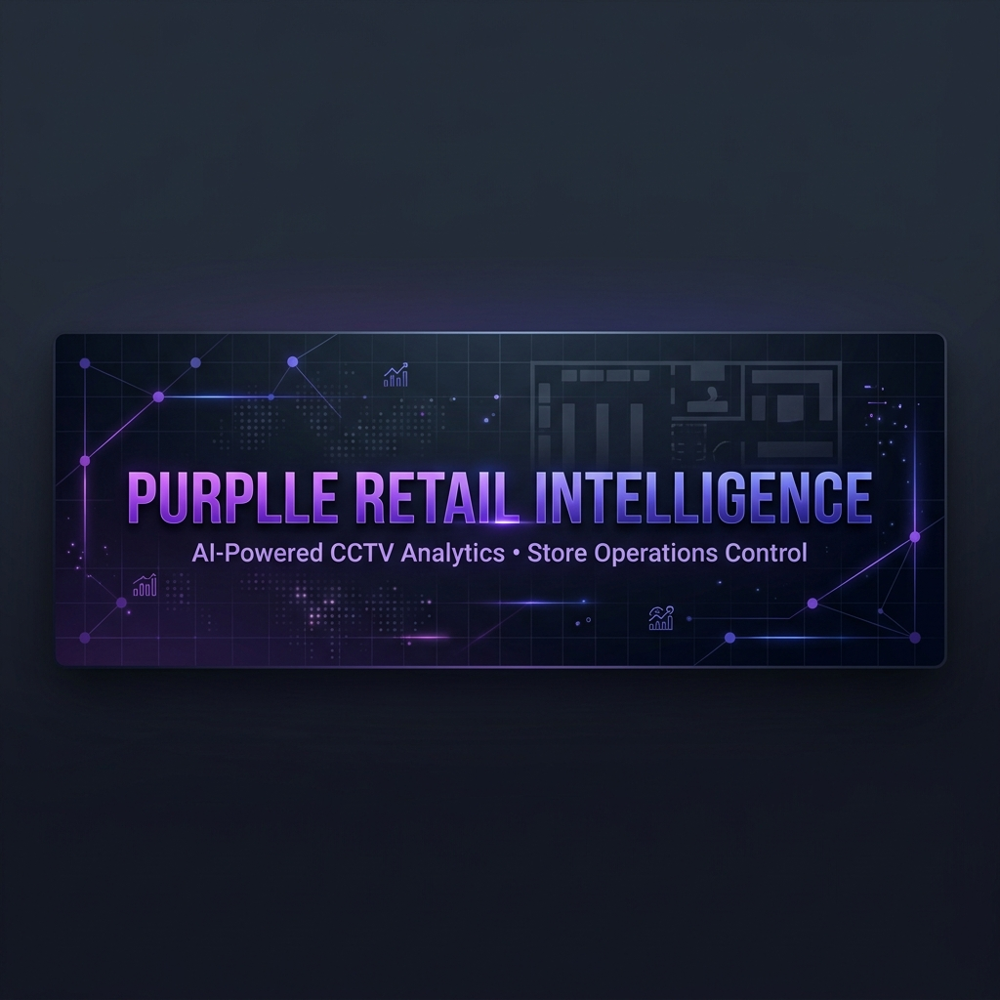
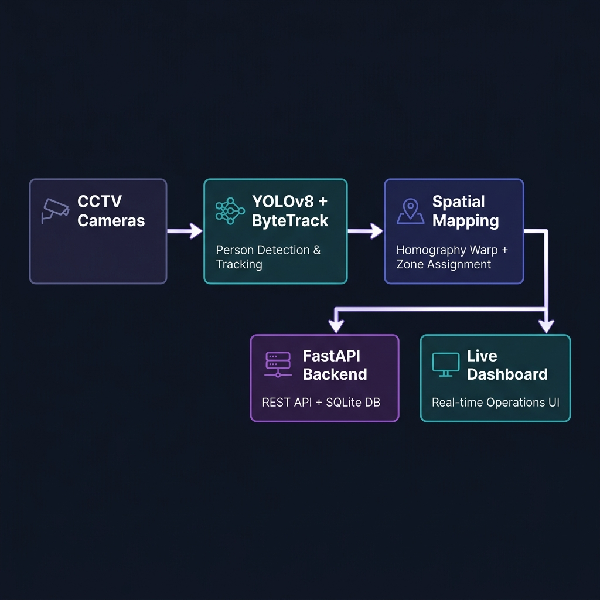
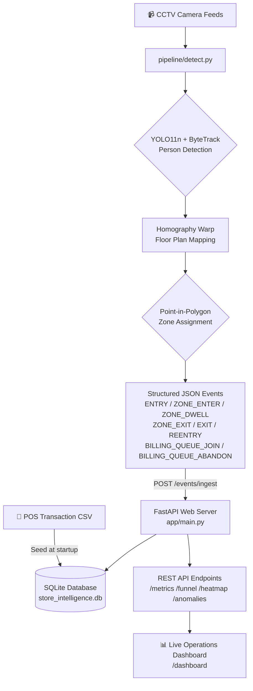
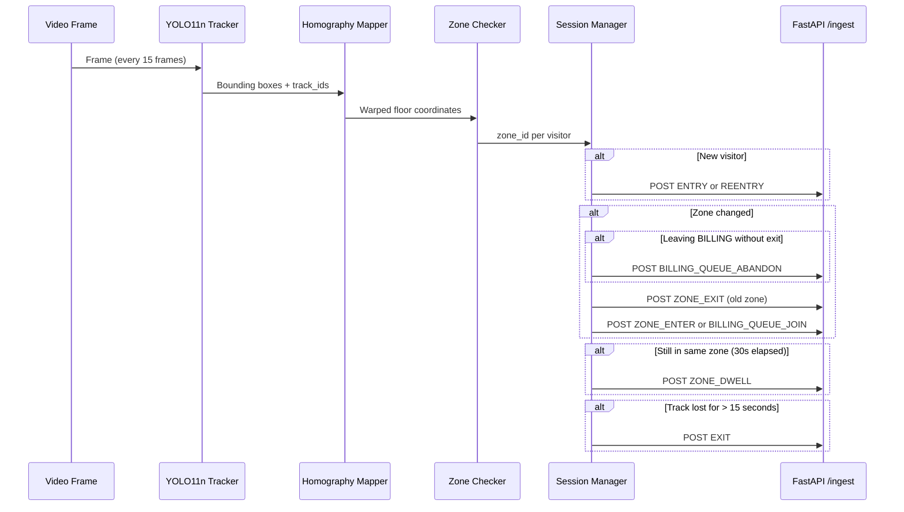
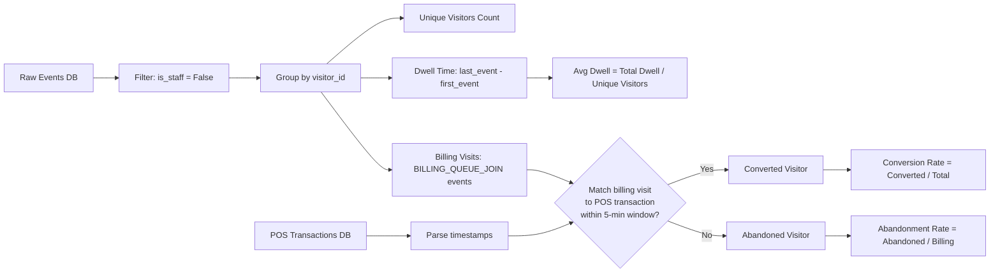

<p align="center">
  
</p>

<p align="center">
  
</p>

<p align="center">
  <a href="https://github.com/keshabkjha/purplle-retail-intelligence/actions"></a>
  <a href="https://www.python.org/downloads/"></a>
  <a href="https://fastapi.tiangolo.com"></a>
  <a href="https://docs.ultralytics.com"></a>
  <a href="https://docs.docker.com/compose/"></a>
  <a href="LICENSE"></a>
</p>

<p align="center">
  <strong>An end-to-end AI-powered retail store operations platform.</strong><br>
  Converts raw CCTV footage into real-time KPIs: visitor funnels, dwell heatmaps, queue management, and anomaly detection.
</p>

<p align="center">
  <a href="#-quick-start">Quick Start</a> •
  <a href="#-architecture">Architecture</a> •
  <a href="#-api-reference">API Reference</a> •
  <a href="#-event-contract">Event Contract</a> •
  <a href="#-tech-stack">Tech Stack</a> •
  <a href="docs/DESIGN.md">Design Doc</a>
</p>

---

## 🎯 What This System Does

Purplle's physical stores were a complete analytics blind spot. This system solves that by treating each CCTV camera as a real-time sensor. Every customer movement — from store entry to zone browsing to billing queue — is converted into a structured event stream, aggregated into business KPIs, and surfaced on a live operations dashboard.

| Capability | Description |
|---|---|
| 🎥 **Person Tracking** | YOLO11n + ByteTrack identifies and tracks individuals across multi-camera store footage |
| 📐 **Spatial Mapping** | Homography perspective warp maps camera foot-positions to a 2D store floor plan |
| ⚡ **Real-time Ingestion** | Structured events posted to FastAPI REST endpoint at sub-100ms latency |
| 📊 **KPI Aggregation** | Conversion rate, dwell time per zone, queue depth, abandonment rate |
| 🚨 **Anomaly Detection** | Statistical queue spikes, 7-day conversion baseline drops, 30-min dead zones |
| 🗺️ **Live Dashboard** | Real-time operations control room with animated spatial heatmap |

---

## ✅ Goals & Scope

| Area | Target |
|---|---|
| Deployment | Local dev, Docker Compose, and Render.com. Kubernetes is optional (no charts shipped). |
| Supported OS | Linux and macOS. Windows via WSL2. |
| Supported Python | 3.11–3.12 |
| Performance | API ingest p95 < 150ms for batches ≤ 200 events. CV pipeline targets ~15 FPS per stream on CPU. |
| Priority | Both the CV pipeline (reference implementation) and API surface (production interface). |

If your deployment or SLAs differ, update this section and the operational guide.

---

## 🏗️ Architecture

<p align="center">
  
</p>

The system uses a **decoupled, event-driven architecture** that cleanly separates the resource-heavy computer vision layer from the low-latency API layer.



### Component Breakdown

```
purplle-retail-intelligence/
├── pipeline/
│   ├── detect.py          # YOLO11n tracker → structured event emitter
│   ├── calibrate.py       # Interactive homography calibration tool
│   └── run.sh             # Multi-camera parallel pipeline launcher
├── app/
│   ├── main.py            # FastAPI router + middleware + health checks
│   ├── database.py        # SQLAlchemy ORM models + POS seeder
│   ├── models.py          # Pydantic event schema validation
│   ├── metrics.py         # KPI aggregation (visitors, dwell, conversion)
│   ├── funnel.py          # Customer journey funnel computation
│   ├── heatmap.py         # Zone intensity heatmap + confidence scoring
│   ├── anomalies.py       # Statistical anomaly detection engine
│   └── dashboard.html     # Self-contained real-time operations UI
├── config/
│   ├── store_layout.json  # Zone polygon definitions (Brigade Road, Bangalore)
│   └── calibration.json   # Camera homography transform matrices
├── data/
│   └── labels/            # Working annotations for supervised staff / re-ID training
├── examples/
│   └── labels/            # Bundled sample JSONL templates
├── scripts/
│   ├── bootstrap_supervised_flow.py # One-command copy + train flow
│   ├── label_helper.py              # Tiny annotation helper
│   └── train_supervised_models.py    # Offline supervised trainer
├── tests/
│   ├── test_pipeline.py   # Core metric + pipeline logic tests
│   ├── test_metrics.py    # KPI aggregation coverage
│   └── test_anomalies.py  # Anomaly detection scenario tests
└── docs/
    ├── DESIGN.md          # Architecture & AI decision rationale
    └── CHOICES.md         # Trade-off analysis & engineering reasoning
```

---

## 🚀 Quick Start

### Option A: Docker (Recommended)

```bash
# 1. Clone the repository
git clone https://github.com/keshabkjha/purplle-retail-intelligence.git
cd purplle-retail-intelligence

# 2. Start the API and database
docker compose up -d --build

# 3. Seed the POS transaction data inside the container
docker compose exec api python3 -m app.ingestion

# 4. Verify the API is live
curl http://localhost:8000/health

# 5. Run the CV pipeline on the host (edge client) streaming events to the API container
python3 pipeline/detect.py "CCTV Footage/entry_camera.mp4"

# 6. Open the live dashboard
open http://localhost:8000/dashboard
```

### Option B: Local Development

```bash
# Install dependencies
pip install -r requirements-dev.txt

# Start the API server
uvicorn app.main:app --reload --host 0.0.0.0 --port 8000

# In a separate terminal, seed the POS data
python3 -m app.ingestion

# Run the pipeline locally on a video clip
python3 pipeline/detect.py "CCTV Footage/entry_camera.mp4"
```

### Option C: Run Tests

```bash
# Run the full comprehensive test suite (26 tests covering edge cases)
python3 -m pytest tests/ -v

# Expected output:
# tests/test_cross_camera.py::test_appearance_based_matching PASSED
# tests/test_cross_camera.py::test_transition_priors PASSED
# tests/test_cross_camera.py::test_reentry_dwell_session_correction PASSED
# tests/test_anomalies.py::test_conversion_drop_anomaly PASSED
# ... 26 passed in ~3s ✅
```

### Optional: Train Supervised Models

If you have labeled staff crops or pairwise identity annotations, you can train offline models and save them into `pipeline/model_state/`.

```bash
python3 scripts/train_supervised_models.py \
  --staff-labels data/labels/staff_labels.jsonl \
  --reid-pairs data/labels/reid_pairs.jsonl \
  --output-dir pipeline/model_state
```

At runtime, `pipeline/detect.py` automatically prefers `staff_supervised.pkl` and `identity_supervised.pkl` when those artifacts exist. If they are missing, the system falls back to the lightweight online models so the demo still works out of the box.

Sample annotation templates live in:
- `examples/labels/staff_labels.sample.jsonl`
- `examples/labels/reid_pairs.sample.jsonl`

For quick manual labeling, use:
```bash
python3 scripts/label_helper.py --mode staff --output data/labels/staff_labels.jsonl
python3 scripts/label_helper.py --mode identity --output data/labels/reid_pairs.jsonl
```

For the fastest reproducible path from a fresh checkout, run one bootstrap command:

```bash
python3 scripts/bootstrap_supervised_flow.py
```

That command:
- creates `data/labels/staff_labels.jsonl` and `data/labels/reid_pairs.jsonl` from the bundled templates if they do not exist
- trains both supervised models
- writes `staff_supervised.pkl` and `identity_supervised.pkl` into `pipeline/model_state/`

---

## 🧪 End-to-End Smoke Test Flow

Follow this exact path from a clean clone to verify the entire system is fully integrated, operational, and production-ready.

### Step 1: Spin Up Infrastructure
Start the FastAPI server and database in Docker:
```bash
docker compose up -d --build
```
Wait a few seconds for database initialization, then verify the health status:
```bash
curl -s http://localhost:8000/health
```
**Expected Response**:
```json
{
  "status": "healthy",
  "database": "healthy",
  "last_event_timestamp": null,
  "stale_feed": false,
  "stores": {}
}
```

### Step 2: Seed POS Transactions
Seed the Brigade Road, Bangalore store's actual POS CSV transaction database inside the running container:
```bash
docker compose exec api python3 -m app.ingestion
```
**Expected Output**:
```
🌱 Seeding POS transactions from: Brigade_Bangalore_10_April_26 (1)bc6219c.csv...
✅ Successfully seeded 24 POS transaction records into tables.
```

### Step 3: Run the Computer Vision Pipeline
Process the CCTV clips in sequence on the host (representing the local edge processor in a store setup). This runs detection + multi-signal Re-ID and streams events directly to the active REST API container:
```bash
python3 pipeline/detect.py "CCTV Footage/entry_camera.mp4"
```
*Note: You can process all available cameras sequentially by running `./pipeline/run.sh`.*

### Step 4: Validate Ingestion & Performance Metrics
Query the store metrics to confirm successful visitor tracking, dwell times, and POS conversion matches:
```bash
curl -s http://localhost:8000/stores/ST1008/metrics
```
**Expected Response**: A rich JSON response containing `unique_visitors`, `conversion_rate`, `average_dwell_minutes`, and `current_queue_depth`.

### Step 5: Check Operations & Anomalies
Query the active operational anomalies to inspect if any statistical warnings (conversion drops, queue depth spikes) have fired:
```bash
curl -s http://localhost:8000/stores/ST1008/anomalies
```

### Step 6: View the Dashboard
Launch the self-contained live operations control room dashboard:
```bash
open http://localhost:8000/dashboard
```
Here, you'll see animated KPI cards, dynamic visitor conversion funnel flows, and a 2-dimensional zone intensity heatmap updated in real-time.

---

## 📡 API Reference

Base URL: `http://localhost:8000`

Interactive docs available at: `http://localhost:8000/docs` (Swagger UI)

### Endpoints

| Method | Endpoint | Description |
|---|---|---|
| `GET` | `/health` | Per-store health status, feed latency, stale detection |
| `GET` | `/ready` | Readiness probe (database + ingest freshness) |
| `GET` | `/live` | Liveness probe |
| `POST` | `/events/ingest` | Bulk ingest structured visitor events (idempotent) |
| `GET` | `/stores/{id}/metrics` | KPIs: visitors, conversion rate, dwell time, queue depth |
| `GET` | `/stores/{id}/funnel` | 4-stage visitor conversion funnel with drop-off rates |
| `GET` | `/stores/{id}/heatmap` | Zone visit frequency, dwell seconds, intensity (0-100) |
| `GET` | `/stores/{id}/anomalies` | Active operational warnings with severity + actions |
| `GET` | `/dashboard` | Self-contained live operations control room UI |

### Sample: Metrics Response

```json
{
  "store_id": "ST1008",
  "unique_visitors": 87,
  "conversion_rate": 24.14,
  "average_dwell_minutes": 12.4,
  "average_dwell_per_zone": {
    "EB_KOREAN": 185.3,
    "LAKME": 142.7,
    "BILLING": 97.2
  },
  "current_queue_depth": 3,
  "abandonment_rate": 8.2
}
```

### Sample: Anomalies Response

```json
{
  "store_id": "ST1008",
  "anomalies": [
    {
      "anomaly_type": "STATISTICAL_QUEUE_SPIKE",
      "severity": "CRITICAL",
      "suggested_action": "Open additional billing counter immediately.",
      "details": "Queue depth 9 exceeds statistical threshold of 6.2 (Avg: 3.1)."
    },
    {
      "anomaly_type": "DEAD_ZONE",
      "severity": "INFO",
      "suggested_action": "Inspect product display in the MINIMALIST zone.",
      "details": "Zone 'MINIMALIST' has received 0 customer visits in the past 30 minutes."
    }
  ]
}
```

---

## 📋 Event Contract

All events posted to `POST /events/ingest` must conform to this schema:

| Field | Type | Required | Description |
|---|---|---|---|
| `event_id` | `UUID` | ✅ | Unique event identifier (idempotency key) |
| `store_id` | `string` | ✅ | Store identifier (e.g. `ST1008`) |
| `camera_id` | `string` | ✅ | Source camera ID (e.g. `CAM_ENTRY_01`) |
| `visitor_id` | `string` | ✅ | Tracker-assigned session ID (e.g. `VIS_42`) |
| `event_type` | `enum` | ✅ | See event type table below |
| `timestamp` | `ISO8601` | ✅ | Event UTC timestamp |
| `zone_id` | `string \| null` | ✅ | Target zone identifier |
| `dwell_ms` | `integer` | ✅ | Time spent in zone (milliseconds) |
| `is_staff` | `boolean` | ✅ | Whether visitor is staff (excluded from metrics) |
| `confidence` | `float` | ✅ | YOLO detection confidence score (0.0–1.0) |
| `metadata.queue_depth` | `integer \| null` | — | Current billing queue length |
| `metadata.sku_zone` | `string \| null` | — | Product category in current zone |
| `metadata.session_seq` | `integer` | — | Sequential event counter per visitor session |

### Event Types

| Event Type | Trigger |
|---|---|
| `ENTRY` | Visitor appears for the first time in the store |
| `REENTRY` | Visitor who previously exited reappears |
| `ZONE_ENTER` | Visitor moves into a new retail zone |
| `ZONE_DWELL` | Visitor still in zone after every 30-second interval |
| `ZONE_EXIT` | Visitor leaves a zone |
| `BILLING_QUEUE_JOIN` | Visitor enters the BILLING zone |
| `BILLING_QUEUE_ABANDON` | Visitor leaves BILLING zone without completing purchase |
| `EXIT` | Visitor disappears from all camera feeds (session end) |

---

## 🔍 Detection Pipeline



---

## 📊 KPI Calculation Logic



---

## 🚨 Anomaly Detection Rules

| Anomaly | Trigger Condition | Severity | Action |
|---|---|---|---|
| `STATISTICAL_QUEUE_SPIKE` | Queue depth > mean + 1.5σ over all history | `WARN` / `CRITICAL` | Open additional billing counter |
| `CONVERSION_DROP` | Current rate < 70% of 7-day rolling baseline | `WARN` | Check checkout bottlenecks |
| `DEAD_ZONE` | Zero visits to a retail zone in past **30 minutes** | `INFO` | Inspect product display & visibility |

---

## 🛠️ Tech Stack

| Layer | Technology | Rationale |
|---|---|---|
| **Object Detection** | YOLO11n (Ultralytics) | 22% fewer params than v8, same API, better CPU efficiency |
| **Object Tracking** | ByteTrack (built-in) | Low-ID-switch rate for persistent session tracking |
| **Spatial Mapping** | OpenCV Homography | Perspective-correct floor projection from camera |
| **Zone Logic** | Pure Python Ray Casting | Zero native dependencies vs. Shapely/GEOS |
| **API Framework** | FastAPI + Uvicorn | Async, typed, auto-documented REST API |
| **ORM & DB** | SQLAlchemy + SQLite | Zero-config persistence for hackathon scope |
| **Data Validation** | Pydantic v2 | Schema enforcement on every ingest event |
| **Containerization** | Docker + Compose | Reproducible single-command deployment |
| **Testing** | Pytest + TestClient | In-memory SQLite isolation per test fixture |
| **Logging** | Structured JSON (stdout) | Trace IDs, latency, event counts per request |

---

## 🧪 Test Coverage

```
tests/
├── test_pipeline.py     # Entry/exit metrics, staff exclusion, re-entry
├── test_metrics.py      # Conversion rate, dwell time, queue depth, validation
├── test_anomalies.py    # Queue spike (WARN + CRITICAL), conversion drop, dead zones
├── test_cross_camera.py # Cross-camera Re-ID, transition priors, batch limit, stale feed, training round-trip
└── test_supervised_runtime.py # Supervised artifact load smoke test

Total: 26 tests | Status: ✅ All Passing
```

Run with:
```bash
python3 -m pytest --tb=short
```

---

## ⚙️ Configuration

| Variable | Default | Description |
|---|---|---|
| `DATABASE_URL` | `sqlite:///./store_intelligence.db` | Database connection string |
| `ENV` | `dev` | Environment name (`dev`/`prod`) |
| `ALLOWED_ORIGINS` | `*` | Comma-separated CORS origins |
| `RATE_LIMIT_PER_MINUTE` | `120` | Per-IP request limit |
| `RATE_LIMIT_WINDOW_SECONDS` | `60` | Rate-limit window in seconds |
| `MAX_INGEST_BATCH` | `500` | Maximum events per ingest request |
| `INGEST_URL` | `http://localhost:8000/events/ingest` | Pipeline ingest endpoint |

For production deployments, see [docs/OPERATIONS.md](docs/OPERATIONS.md).

---

## 🧰 Quality & Tooling

```bash
# Lint + format
ruff check . --fix
ruff format .

# Type checks
mypy

# Tests + coverage
pytest
```

Pre-commit hooks:
```bash
pre-commit install
```

---

## 🔐 Security

- Dependency updates: Dependabot
- Static analysis: CodeQL
- Secret scanning: gitleaks workflow
- Threat model: [docs/THREAT_MODEL.md](docs/THREAT_MODEL.md)

---

## 🗂️ Store Layout (Brigade Road, Bangalore — Store ID: ST1008)

```
┌─────────────────────────────────────────────────────┐
│  ENTRY   │  EB_KOREAN │ THE_FACE_SHOP │  MINIMALIST │
│  PORTAL  ├────────────┼──────────────┼─────────────┤  BILLING /
│  [CAM_   │   LAKME    │  MAYBELLINE  │  GOOD_VIBES │  CHECKOUT
│  ENTRY]  │            │              │             │  [CAM_BILLING]
└──────────┴────────────┴──────────────┴─────────────┘
     [CAM_MAIN_01]        [CAM_MAIN_02]  [CAM_MAIN_03]
```

Zone coordinates are stored in `config/store_layout.json` as polygon arrays matched to the `Revised.png` floor plan.

---

## 📐 Calibration Tool

To map camera footage to the floor plan for a new store:

```bash
# Step 1: Collect source points from camera frame
python3 pipeline/calibrate.py "CCTV Footage/entry_camera.mp4"

# Step 2: Collect destination points from floor plan image
python3 pipeline/calibrate.py Revised.png

# Step 3: Save to config/calibration.json
{
  "CAM_ENTRY_01": {
    "src": [[x1,y1], [x2,y2], [x3,y3], [x4,y4]],
    "dst": [[mx1,my1], [mx2,my2], [mx3,my3], [mx4,my4]]
  }
}
```

> **Note:** The pipeline automatically falls back to sensible linear scaling matrices if a camera is not yet calibrated, so the system works out-of-the-box without calibration.

---

## 🚢 Deployment

### Render.com (Recommended)

1. Connect your GitHub repository on [render.com](https://render.com)
2. Set **Build Command**: `pip install -r requirements.txt`
3. Set **Start Command**: `uvicorn app.main:app --host 0.0.0.0 --port 10000`
4. Dashboard will be live at `https://your-service.onrender.com/dashboard`

---

## 📄 Documentation

| Document | Description |
|---|---|
| [DESIGN.md](docs/DESIGN.md) | Full architecture overview, AI-assisted decision log, trade-off rationale |
| [CHOICES.md](docs/CHOICES.md) | Library selection reasoning, engineering trade-offs |
| [OPERATIONS.md](docs/OPERATIONS.md) | Configuration, observability, and production guidance |
| [THREAT_MODEL.md](docs/THREAT_MODEL.md) | Security assumptions and mitigations |

---

## 📦 Releases & Support

- Versioning: Semantic Versioning (see [CHANGELOG.md](CHANGELOG.md))
- Support policy: [SUPPORT.md](SUPPORT.md)

---

## 👤 Author

**Keshab Kumar** — [@keshabkjha](https://github.com/keshabkjha)

> Built for the **Purplle Tech Challenge 2026 – Round 2**

---

## 📜 License

This project is licensed under the MIT License — see the [LICENSE](LICENSE) file for details.
