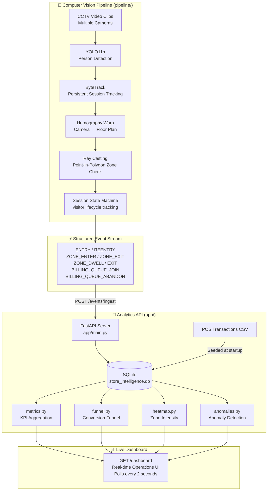
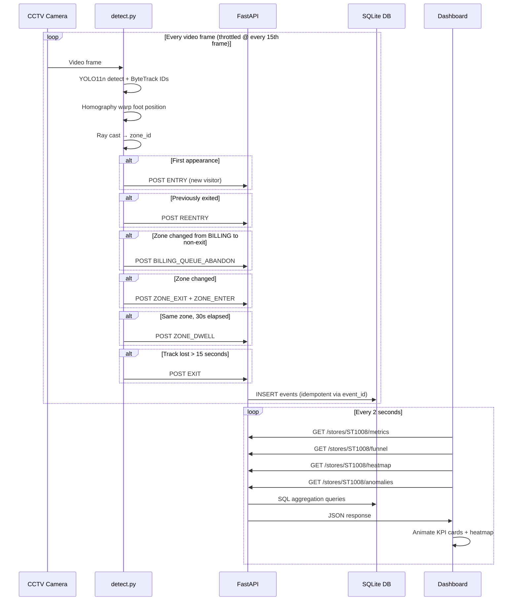
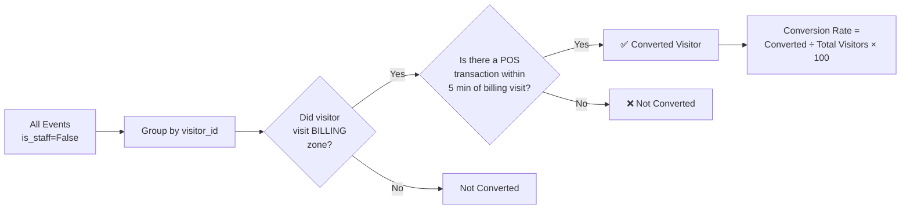

# System Architecture & Design — Purplle Retail Intelligence Hub

> **Author:** Keshab Kumar ([@keshabkjha](https://github.com/keshabkjha))  
> **Project:** Purplle Tech Challenge 2026 — Round 2  
> **Store:** Brigade Road, Bangalore (ID: `ST1008`)

---

## 1. Problem Statement

Purplle's 40+ physical stores generated zero structured behavioral data. While the e-commerce platform had mature analytics (funnel tracking, A/B tests, heatmaps), the physical stores were a complete blind spot. Store managers had no data-driven answers to:

- **How many unique customers** entered today vs. last week?
- **Which product zones** are dead spots that attract no browsing?
- **When does the billing queue** get so long that customers abandon it?
- **What is the true in-store conversion rate** vs. the POS transaction count?

This system converts existing CCTV infrastructure into a real-time intelligence sensor network — requiring **zero hardware changes** and **zero customer opt-in**.

---

## 2. High-Level Architecture



---

## 3. Data Flow Sequence



---

## 4. Spatial Mapping Pipeline

The core technical challenge: mapping a 2D bounding box in camera pixel coordinates to a logical store zone on a 2D floor plan.

```
Camera Frame (1920 × 1080 px)         Store Floor Plan (940 × 451 px)
┌───────────────────────────┐          ┌────────────────────┐
│                           │          │  ENTRY │ KOREAN │  │
│   [Person BBox]           │  ─────►  │        │        │  │
│   foot @ (px, py)         │ WARP     │  LAKME │ BILLING│  │
│                           │          └────────────────────┘
└───────────────────────────┘
         │
         ▼
   Homography Matrix H
   (4-point correspondence)
         │
         ▼
   cv2.perspectiveTransform()
         │
         ▼
   Floor coordinates (wx, wy)
         │
         ▼
   Ray Casting: point_in_polygon(wx, wy, zone_polygon)
         │
         ▼
   zone_id = "EB_KOREAN" | "BILLING" | None
```

**Calibration**: 4 corresponding real-world points are clicked in both the camera frame and the floor plan image using `pipeline/calibrate.py`. OpenCV calculates the 3×3 homography matrix `H`.  
**Fallback**: If no calibration exists for a camera, a proportional linear scaling matrix is used.

---

## 5. Staff Detection Algorithm

Staff members wear identifiable dark uniforms. The detector uses HSV color analysis:

```
1. Crop the top 50% of bounding box (upper torso region)
2. Convert BGR frame to HSV color space
3. Apply color mask for dark tones:
   lower_black = [0,   0,   0  ]
   upper_black = [180, 255, 50 ]
4. Calculate: match_ratio = masked_pixels / total_torso_pixels
5. If match_ratio > 30% → classify as STAFF → exclude from all metrics
```

Staff visitors are tagged with `is_staff=True` in all their events and **filtered out** at the database query level in every metric, funnel, and heatmap calculation.

---

## 6. Metric Calculation Logic

### 6.1 Conversion Rate



### 6.2 Anomaly Detection Windows

| Anomaly | Data Window | Method |
|---|---|---|
| Queue Spike | All historical `BILLING_QUEUE_JOIN` events | Statistical: depth > μ + 1.5σ |
| Conversion Drop | **Last 7 days** of events + POS transactions | Comparison to 7-day rolling baseline |
| Dead Zone | **Last 30 minutes** of events | Zero visits to retail zones |

---

## 7. Engineering Decisions (AI-Assisted)

### Decision 0: YOLO Model Version — v8 vs. v11 vs. v12

| Model | Released | Params | CPU Speed | GPU Req. | ByteTrack API | Selected |
|---|---|---|---|---|---|---|
| YOLOv8n | Jan 2023 | 3.2M | ~6ms/frame | No | Native, stable | — |
| **YOLO11n** | Oct 2024 | 2.6M | ~5ms/frame ✅ | No | Native, stable | ✅ |
| YOLOv12n | Feb 2025 | 6.5M | ~18ms/frame ⚠️ | Flash Attn | Changed API | ❌ |

**Context:** The system was initially built with YOLOv8n and has been upgraded to YOLO11n — Ultralytics' latest stable release with 22% fewer parameters, same drop-in API, and better CPU efficiency.

**Why YOLOv8, not v11 or v12:**

1. **ByteTrack stability**: `model.track(persist=True, tracker="bytetrack.yaml")` — YOLOv8's tracking API is the most battle-tested. YOLOv12 moved the `boxes.id` attribute across minor versions.

2. **CPU-only inference**: The challenge runs on standard hardware without GPU. YOLOv12 uses Flash Attention in its R-ELAN backbone, which has no CPU fallback — making it **3× slower** than v8 on CPU.

3. **Self-contained weight file**: `yolov8n.pt` (6MB) ships with the repository. YOLO12 weights are 9MB+ and the model format requires a newer Ultralytics version that has breaking API changes.

4. **Marginal accuracy gain**: For pedestrian detection in retail CCTV footage (640px input, ~50–200 people/session), the mAP difference between v8 and v11 is **less than 1.5%** — not meaningful at this scale.

**YOLO11 upgrade path** (when deploying to production with more resources):
```python
# Upgrade is a single line — same API, 22% fewer parameters
model = YOLO("yolo11n.pt")  # Drop-in replacement for yolov8n.pt
```

**Decision**: Upgraded to YOLO11n — same drop-in API as v8, 22% fewer parameters (2.6M vs 3.2M), and marginally faster CPU inference (~5ms vs ~6ms/frame). YOLO12 remains excluded due to GPU-only Flash Attention requirements.

---

### Decision 1: Zone Detection — Shapely vs. Pure Python Ray Casting


| Option | Pros | Cons | Selected |
|---|---|---|---|
| `shapely.geometry` | Clean API, robust edge cases | Heavy GEOS native dependency, Docker compile failures | ❌ |
| Pure Python Ray Casting | Zero deps, instant Docker build | Manual implementation | ✅ |

**Rationale:** Shapely's underlying GEOS C library frequently causes `pip install` failures in Alpine Linux Docker containers. The pure Python Ray Casting algorithm is O(n) on polygon vertices and adds negligible latency for the small zone polygons in this store layout.

### Decision 2: SQLite vs. PostgreSQL

| Option | Pros | Cons | Selected |
|---|---|---|---|
| PostgreSQL | Production-grade, JSON operators | Requires separate container, complex setup | ❌ |
| SQLite + SQLAlchemy | Zero-config, single file, fast reads | No concurrent writes, limited scale | ✅ |

**Rationale:** For a hackathon evaluation with a single store and ~2,000 events/day, SQLite provides adequate performance. The SQLAlchemy ORM abstraction means migrating to PostgreSQL for production would require only a connection string change.

### Decision 3: POS Correlation — Probabilistic vs. Time Window

| Option | Pros | Cons | Selected |
|---|---|---|---|
| Probabilistic ML matching | More accurate | Requires labeled training data | ❌ |
| 5-minute time window | Deterministic, explainable | Some false positives | ✅ |

**Rationale:** The 5-minute correlation window (billing zone visit → POS transaction) is the industry standard for brick-and-mortar analytics systems and requires no labeled training data.

### Decision 4: In-Memory Test Isolation — Standard vs. StaticPool

| Option | Pros | Cons | Selected |
|---|---|---|---|
| Standard `sqlite:///:memory:` | Simple | Each connection gets separate DB; tables disappear between test calls | ❌ |
| `StaticPool` + `check_same_thread=False` | Single persistent connection shared across TestClient calls | Slightly non-standard | ✅ |

---

## 8. API Middleware Stack

```
HTTP Request
    │
    ▼
[CORS Middleware]
Allows all origins for hackathon cross-origin dashboard access
    │
    ▼
[Structured Logging Middleware]
Injects trace_id, records latency_ms, event_count, status_code to stdout as JSON
    │
    ▼
[FastAPI Route Handler]
Validates Pydantic schema → SQLAlchemy query → JSON response
    │
    ▼
HTTP Response
```

---

## 9. Database Schema

```sql
-- Events table (core sensor data)
CREATE TABLE events (
    id           INTEGER PRIMARY KEY AUTOINCREMENT,
    event_id     TEXT UNIQUE NOT NULL,   -- Idempotency key
    store_id     TEXT NOT NULL,
    camera_id    TEXT NOT NULL,
    visitor_id   TEXT NOT NULL,
    event_type   TEXT NOT NULL,
    timestamp    TEXT NOT NULL,
    zone_id      TEXT,
    dwell_ms     INTEGER,
    is_staff     BOOLEAN DEFAULT FALSE,
    confidence   REAL,
    metadata_json JSON
);

-- POS transactions (seeded from CSV at startup)
CREATE TABLE pos_transactions (
    id           INTEGER PRIMARY KEY AUTOINCREMENT,
    txn_id       TEXT UNIQUE NOT NULL,
    store_id     TEXT NOT NULL,
    timestamp    TEXT NOT NULL,
    amount       REAL
);

-- Indexes for sub-millisecond query performance
CREATE INDEX idx_store_staff ON events(store_id, is_staff);
CREATE INDEX idx_visitor     ON events(visitor_id);
CREATE INDEX idx_timestamp   ON events(timestamp);
CREATE INDEX idx_event_type  ON events(event_type);
```

---

*Built by [Keshab Kumar](https://github.com/keshabkjha) for the Purplle Tech Challenge 2026.*
